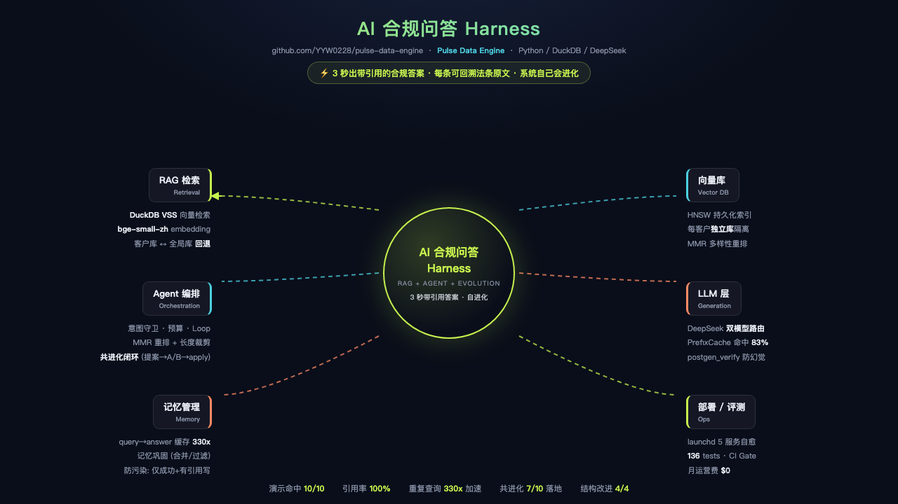

# 🚀 Pulse Data Engine

> **运行状态 (2026-08-05)**: 已迁移至 Mac Mini 常开 (8501/8502/9464/8000/telegram, 见 hermes-brain/migration/MIGRATION-MAC-MINI.md)。数据三保险: Mac backups 553MB + Cloudflare R2 206MB + GitHub。VPS 已弃用。

**零成本、多源、生产级数据引擎 — 从采集到可视化，一条管道，月运营费 $0**



> **AI 合规问答 Harness**: 3 秒出带引用的合规答案 · 每条可回溯法条原文 · 系统自己会进化 (共进化闭环) — [交互版 HTML](docs/assets/qa-harness-mindmap-cover.html) · [详细架构图](docs/assets/qa-harness-arch.png) · [思维导图文档](docs/qa-harness-mindmap.md)

[](https://github.com/YYW0228/pulse-data-engine/actions/workflows/ci.yml)
[](https://www.python.org/)
[](LICENSE)
[](https://duckdb.org/)

---

## 为什么是 Pulse？

数据工程不应该只有大厂才做得起。Pulse 是一个**生产级、零成本、可横向复制的数据引擎**，能在 5 分钟内从零搭建一条完整的数据管道 —— 带 CI/CD、可观测性、time travel、多源采集、以及浏览器内 SQL 查询。

```bash
git clone https://github.com/YYW0228/pulse-data-engine
cd pulse-data-engine
uv sync
make test        # 验证门禁
make up          # 启动全部服务
```

---

## 架构设计

### Harness 架构：机制与策略解耦

Pulse 的核心设计理念是 **Harness 架构** —— 将通用的数据工程"机制"与领域特定的"策略"严格分离：

```
领域层 (可替换)          适配器层 (薄映射)          Harness (零改动)
┌──────────────┐       ┌──────────────┐       ┌──────────────────┐
│ JobContract   │       │ 字段映射      │       │ Dagster 资产图    │
│ ProductContract│────→│ job_title ←  │────→│ SCD Type 2 合并   │
│ (Pydantic)    │       │ product_title│       │ DLQ 死信队列      │
├──────────────┤       ├──────────────┤       ├──────────────────┤
│ Remotive      │       │ 分类规则      │       │ Fetcher v2        │
│ Shopify Mock  │       │ 聚合 SQL     │       │ (Circuit Breaker) │
│ (Extractor)   │       │              │       │ Iceberg 冷存储    │
└──────────────┘       └──────────────┘       │ Prometheus Metrics│
                                               │ CI/CD 门禁        │
                                               └──────────────────┘
```

**已验证跨领域**：同一套 Harness 同时运行招聘（5 源）和零售（1 源）数据，Pipeline 零改动。[查看刺杀测试](pulse/contracts/retail.py)

### 数据流

```
┌─ 数据源 ───────────────────────────────────┐
│ Remotive API (招聘, 免费, 无需 key)        │
│ Jobicy API (招聘, 免费, 无需 key)          │
│ Shopify Mock (零售, 适配器验证)            │
│ ... (任意领域, 只需一个 Pydantic Contract) │
└────────────┬──────────────────────────────┘
             │
             ▼
┌─ 采集层 (Fetcher v2) ─────────────────────┐
│ • Circuit Breaker: 429/503 风暴保护        │
│ • Full Jitter: AWS 风格退避               │
│ • Retry-After: 尊重服务器限流指令          │
│ • 自适应超时: 15s → 60s 弹性增长          │
│ • Prometheus 埋点                          │
└────────────┬──────────────────────────────┘
             │
             ▼
┌─ 数据契约 (Pydantic) ─────────────────────┐
│ ✅ 校验通过 → ODS (SCD Type 2)            │
│ ❌ 校验失败 → DLQ (可修复/可重入)         │
│                                             │
│ 容错设计: city 过长自动截断                │
│           salary min>max 自动交换           │
└────────────┬──────────────────────────────┘
             │
             ▼
┌─ 三层数仓 (Medallion Architecture) ──────┐
│                                             │
│ ODS: 原始数据 (SCD Type 2, append-only)    │
│  ├─ SCD Type 2: 双哈希幂等合并             │
│  │  entity_id = md5(url)                   │
│  │  content_hash = md5(title|salary|city)  │
│  │                                          │
│ DWD: 清洗 + 分类 (最新版本)                │
│  ├─ 类型转换 + 空值过滤                    │
│  └─ 正则分类 (多级优先级)                  │
│                                             │
│ DWS: 预计算聚合                            │
│   ├─ 薪资百分位 (p25/p50/p75)              │
│   └─ 城市/品类维度聚合                     │
└────────────┬──────────────────────────────┘
             │
             ▼
┌─ 冷存储 ───────────────────────────────────┐
│ 🔥 DuckDB 热 (活跃 SCD Type 2)          │
│ 📦 Parquet 冷 (Hive 分区, 向后兼容)      │
│ 🧊 Iceberg (time travel, 多快照保留)     │
└────────────┬──────────────────────────────┘
             │
             ▼
┌─ 交付 ─────────────────────────────────────┐
│ 📊 Streamlit Dashboard (数据对账)         │
│ 🦆 DuckDB WASM (浏览器 SQL 直查 Parquet) │
│ 📈 Prometheus Metrics (15 个指标)         │
└────────────────────────────────────────────┘
```

### SCD Type 2 算法

```python
entity_id = md5(url)                    # 实体指纹, 稳定不变
content_hash = md5(title|salary|city)   # 内容指纹, 只对业务变化敏感

场景             行为                         结果
─────────────────────────────────────────────────────────
新实体           INSERT                      1 条新行
内容未变         UPDATE crawled_at            0 新行, 标记活跃
内容改变         UPDATE 旧 + INSERT 新        2 行, is_latest 区分
```

**防止存储膨胀**: content_hash 基于业务内容，不是时间戳。同一岗位连续 30 天不变 → 1 行。

---

## 一键部署

```bash
# 开发环境 — 全部服务
make up
# 📊 Metrics:   http://localhost:9464/metrics
# 🦆 WASM SQL:  http://localhost:8000/wasm
# 🚀 Dashboard: http://localhost:8501
# 🎬 Dagster:   http://localhost:3000

# 生产运行
make deploy-run

# 停止
make down
```

### 生产部署

详见 [Production Deployment](#生产部署)。

| 组件 | 端口 | 说明 |
|------|------|------|
| Metrics | 9464 | Prometheus scrape target + `/snapshot` |
| WASM | 8000 | DuckDB WASM 浏览器 SQL 查询 |
| Streamlit | 8501 | 数据对账 Dashboard |
| Dagster | 3000 | 资产编排 UI + 调度 |

---

## 技术栈

| 层 | 技术 | 用途 |
|----|------|------|
| 包管理 | **uv** (Rust) | pip 的 100x 速度 |
| 编排 | **Dagster** | 资产导向, 8 assets, 6h cron |
| 热存储 | **DuckDB** | 列式 OLAP, SCD Type 2 |
| 冷存储 | **Parquet** + **Iceberg** | time travel, 多快照保留 |
| 校验 | **Pydantic v2** | Data Contracts |
| 采集 | **httpx** | Fetcher v2 (Circuit Breaker) |
| 可观测 | **Prometheus** | 15 个指标, DAG/Pipeline/Fetcher |
| 交付 | **Cloudflare R2** + **DuckDB WASM** | 零成本查询 |
| CI/CD | **GitHub Actions** | ruff + mypy + pytest + gitleaks |

---

## 数字

```text
59 测试 (100% 通过)    8 资产 Dagster       7 次/日调度
$0 月运营              5 数据源共存         ~1200 实体
11.6s 全管道运行       15 Prometheus 指标    Iceberg 多快照
DLQ 增量 ~1/run        3 领域验证通过       CI 门禁硬约束
```

---

## 领域适配

Pulse 的 Harness 架构支持任意领域的数据管道。已验证：

| 领域 | 数据源 | 适配改动 | 状态 |
|------|--------|---------|------|
| 招聘 | Remotive, Jobicy, Firecrawl | 0 (原生) | ✅ 生产 |
| 零售 | Shopify Mock | 1 contract + 1 adapter | ✅ 验证 |
| 你的领域 | ? | 1 contract + 1 extractor | ⏳ |

```bash
# 接入新领域只需:
# 1. 定义 Pydantic Contract (pulse/contracts/your_domain.py)
# 2. 写适配器映射到 ODS 通用字段
# 3. 写 Extractor (pulse/extractors/your_source.py)
# 4. 注册到 Dagster asset (可选)
```

---

## 项目结构

```
pulse/
├── assets.py           # Dagster 资产定义 (8 assets)
├── pipeline.py         # 三层数仓 + SCD Type 2 + DLQ
├── fetcher.py          # Fetcher v2 (Circuit Breaker + Full Jitter)
├── schema.py           # Data Contract (RawJobContract)
├── metrics.py          # Prometheus 指标注册中心
├── metrics_server.py   # /metrics HTTP 端点
├── wasm_server.py      # 本地 Parquet HTTP 服务器
├── contracts/          # 领域数据契约
│   └── retail.py       # ProductContract (零售验证)
├── extractors/         # 数据源适配器
│   ├── __init__.py     # Remotive API
│   ├── jobicy.py       # Jobicy API
│   └── shopify_mock.py # 零售 Mock
├── monitor.py          # 质量 SLA + 告警
├── backup.py           # gzip + R2 备份
├── checkpoints.py      # 断点续传
└── dag.py              # (deprecated) 旧手写 DAG, 新逻辑走 assets.py
scripts/
├── run_production.py   # 生产运行器 (metrics + report + R2)
├── alert_check.py      # DLQ/成功率告警扫描
├── analyze_runs.py     # dag_runs 运行分析
└── sync_r2.py          # Parquet → R2 同步
tests/
├── test_contracts.py   # 8 tests
├── test_fetcher.py     # 6 tests (Circuit Breaker)
├── test_jobicy.py      # 7 tests (keyword coercion)
├── test_metrics.py     # 9 tests (97% coverage)
├── test_pipeline.py    # SCD Type 2 / DLQ / 分类
├── test_ops.py         # 监控 + 检查点
└── test_performance.py # 性能基准
```

---

## 生产部署

[完整部署文档 →](docs/ARCHITECTURE.md) · [架构思维导图 (面试/讲述版) →](docs/qa-harness-mindmap.md)

```bash
# 1. 配置 Secrets
cp .env.example .env
# 填入 CF_ACCOUNT_ID, CLOUDFLARE_API_TOKEN, SLACK_WEBHOOK_URL

# 2. GitHub Actions Secrets (仓库 Settings → Secrets)
# CF_ACCOUNT_ID, CLOUDFLARE_API_TOKEN, SLACK_WEBHOOK_URL (可选)

# 3. 定时调度 (GitHub Actions + Dagster 双保险)
# GitHub Actions: cron 每天 02/08/14/20 UTC
# Dagster:        pulse_etl_schedule, cron 0 2,8,14,20 * * *

# 4. 手动触发
make deploy-run
```

---

## 许可证

MIT © [YYW0228](https://github.com/YYW0228)

---

> **架构是权衡的艺术。Pulse Data Engine 为 <100GB、单机、零成本场景做了最优权衡。**
> 不适合: 超大规模 (>100GB)、多用户并发、强 ACID 事务。那时应上 Spark/Databricks/Snowflake。
