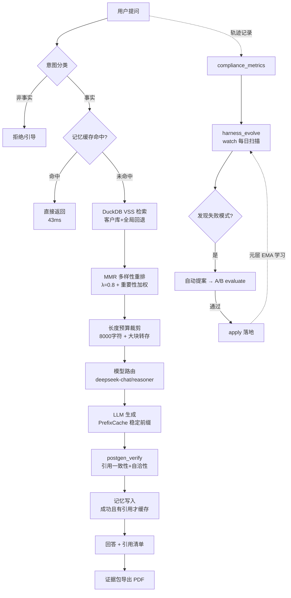

# AI 合规问答 Harness — 架构思维导图 (面试讲述版)

> 中心主题: **企业 AI 合规问答系统** — 基于 RAG + Agent 治理 + 共进化闭环
> 一句话定位: 3 秒出带引用的合规答案, 系统自己会进化 (自改进 RAG Harness)

---

## 一、分层架构大纲 (顺图讲述顺序)

### 中心: AI 合规问答 Harness
- 定位: 企业 AI 合规问答 (算法备案/欧盟 AI 法案/GDPR/数据跨境)
- 差异化: 引用溯源 (每条答案可回溯法条) + 证据包 (可导出交付) + 自进化 (共进化闭环)
- 成本: 月运营费 $0 (Mac 本地 + DuckDB + 免费 embedding)

### 第一层 — 业务/功能模块 (用户视角)
```
用户交互 (Streamlit 8502 / API)
  ├── 意图分类 (factual/attack/roleplay/probe/meta)
  ├── RAG 检索 (57 全局法规文档 + 客户独立库)
  ├── 记忆管理 (query→answer 缓存 + 记忆巩固)
  ├── 回答生成 (DeepSeek, 带引用)
  ├── 生成后验证 (postgen_verify: 引用一致性/自洽性)
  └── 证据包导出 (demo_pack → PDF, 可交付审计)
```

### 第二层 — 技术实现
```
前端/接口: Streamlit (8501/8502) + compliance_service (统一入口)
LLM 调用: DeepSeek 双模型路由 (deepseek-chat 默认 / reasoner 复杂升级)
  └── PrefixCache 稳定化 (system prompt 版本化 + append-only history → 命中率 83%+)
向量库: DuckDB VSS + BAAI/bge-small-zh-v1.5 (512 维, HNSW 持久化)
  └── 每客户独立 DuckDB (数据隔离 = 检索质量 + 数据安全)
Agent 编排: 自研中间件链 (intent→budget→loop 守卫) + 模型路由 + 反应式压缩
  └── 共进化闭环 harness_evolve.py (scan/propose/evaluate/apply/watch/meta)
缓存: qa_memory_cache.jsonl (同 query 命中 330x 加速) + 记忆巩固 (合并相似/过滤陈旧)
监控/部署: launchd 5 服务自愈 + CI Gate (ruff→pytest→coverage) + watch cron 06:00
```

### 第三层 — 关键细节与亮点

#### 数据流 (输入 → 处理 → 输出)


#### 难点与解决方案 (面试故事线)

| # | 难点 | 现象 | 解决方案 | 效果 |
|---|------|------|----------|------|
| 1 | 幻觉治理 | 模型引用不存在的文档 | postgen_verify 生成后验证钩子 (引用一致性/自洽性/短回答) | 引用不一致=0, 抓到真实矛盾信号 |
| 2 | 检索质量 | 同质标题刷屏 top-k, 客户文档挤不进 | MMR 多样性重排 + 每客户独立索引库 | 10/10 demo 命中 |
| 3 | 答非所问 | 客户库无法规内容 | 客户库↔全局库竞争回退 (sim 差>0.05 自动回退) | 现场演示停哪个库都能答 |
| 4 | 成本控制 | DeepSeek 长会话缓存命中率 0 | PrefixCache 稳定化 (system 版本化 + append-only) | 第2轮起命中率 83%+ |
| 5 | 重复查询贵 | 同问题每次走 LLM (14.2s) | 记忆缓存 (成功+有引用才写, 完全一致才命中) | 43ms (330x 加速) |
| 6 | 上下文超限 | prompt_is_too_long 400 | 反应式压缩 (保留 system+最近6轮) + 大块转存 | 错误永不暴露给用户 |
| 7 | 系统不进化 | 参数调优靠拍脑袋 | 共进化闭环 (轨迹→失败模式→提案→A/B evaluate→apply) | 10 提案: 7 applied, 结构提案 4/4 全过 |
| 8 | 元层盲区 | 早期数据主导通过率 | EMA 时间衰减 (α=0.4) | 近期经验主导 auto_propose 权重 |
| 9 | 评估失真 | 基线/变异条件不对称 | 对称 A/B (双预热+同缓存状态+串行) | 假拒绝/假通过被消除 |

#### 技术栈标签
`Python 3.12` · `uv` · `FastAPI` · `Streamlit` · `DuckDB VSS` · `bge-small-zh-v1.5` · `DeepSeek API` · `launchd` · `GitHub Actions` · `Mermaid`

---

## 二、效果指标与对比基线

| 指标 | 数值 | 基线/对比 |
|------|------|-----------|
| 演示命中率 | 10/10 (全局 5 + 客户库 5) | 初始 5/6 (quick) |
| 引用率 | 100% (demo 集) | 强化引用格式前 4/10 题 0 引用 |
| 重复查询耗时 | 43ms | 冷 LLM 14.2s (330x) |
| 测试 | 136 passed / 19 文件 | CI 门禁 (ruff + pytest + coverage) |
| 共进化账本 | 10 提案: applied=7, rejected=1 | 结构提案通过率 4/4 (100%) |
| 知识库 | 57 全局文档 + 客户独立库 | 覆盖 EU AI Act 82% (57/69 问) |
| 运营成本 | $0/月 | VPS 时代 ~$23/月 |

## 三、未来扩展

1. **多客户隔离**: customer_onboard 已就位 (每客户独立 DuckDB), 扩展到 N 客户
2. **元层在线学习**: EMA 已上线 (P2), 下一步 P3 提案生成策略自我改进
3. **直播获客闭环**: Pulse Dashboard → DWS → LLM 洞察 → 直播 → 课程转化
4. **向量库升级**: VectorStore ABC 抽象就绪, 10万+块/多租户时切 Qdrant
5. **企业版交付**: 七层收敛骨架 (Surface/Orchestration/Context/Model/Tools/Runtime/Memory), 换文档即可复用

---

## 四、讲述脚本 (30 秒版)

> "这是一个企业 AI 合规问答系统。用户提问 → 意图分类拦截攻击/越权 → 向量检索 (DuckDB VSS + 客户独立库) → MMR 重排 → DeepSeek 生成带引用回答 → 生成后验证防幻觉 → 证据包导出。
> 最特别的是它**自己会进化**: 每条问答轨迹进 metrics, 每日 watch 扫描失败模式, 自动生成改进提案, A/B 评估 (对称双预热), 通过才落地 — 10 个提案里 7 个落地, 结构级改进 4/4 全过。
> 成本: 月 $0。效果: 10/10 演示命中, 每条答案可回溯法条原文。"
